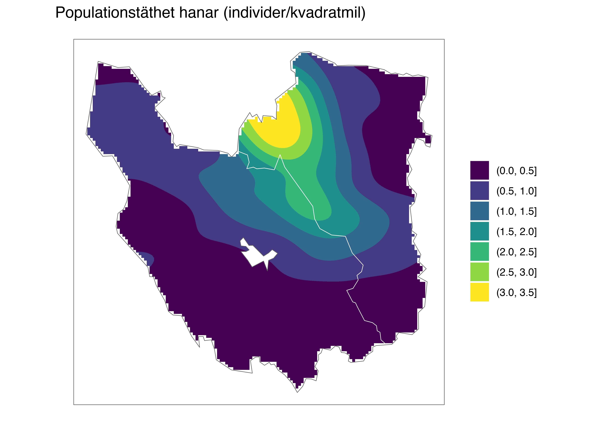
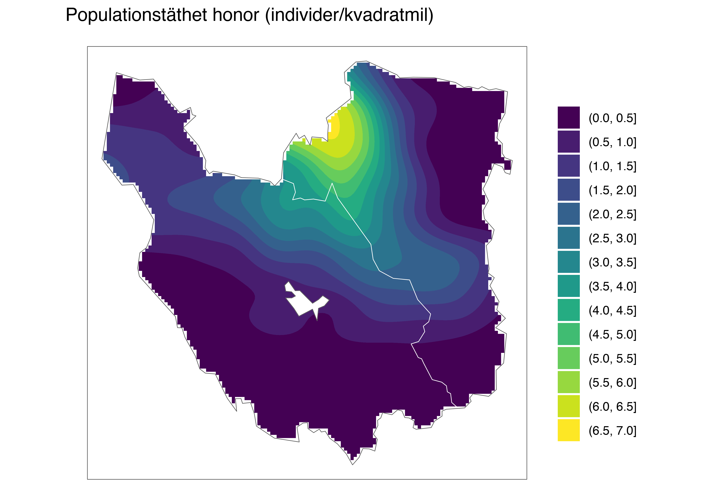

Spillningsinventering björn, Dalarnas, Gävleborgs och Värmlands län 2022
================

Detta bibliotek innehåller programkod och data som använts för
populationsberäkningar av björn, baserat på spillningsinventeringen i
Dalarnas, Gävleborgs och Värmlands län 2022. För jämförelsens skull görs
även beräkningar för inventeringarna 2012 och 2017 med samma metodik.
Metodiken följer fångst-återfångstmetoder föreskrivna av skandinaviska
björnprojektet. Koden är skriven i R och anropar programmet MARK genom
gränssnittet RMark. Skriptet `clean_data.R` sammanställer data baserat
på underlag från RovBase (ej inkluderat då det innehåller
personuppgifter), `functions_gh.R` innehåller funktioner för
modellanpassning.

Utöver den av björnprojektet föreslagna populationsberäkningen redovisas
även en separat uppskattning av populationstätheten i det inventerade
området som även omfattar, Stockholms, Uppsala, Västmanlands och Örebro
län.

## Data

Data baseras på spillningsprover från identifierade björnar inom de
inventerade länen under augusti-oktober 2012, 2017 och 2022 hämtade från
RovBase och sammanställda i `clean_data.R`. Härvid får alla individer en
medelkoordinat per inventeringsår, och tilldelas länstillhörighet
baserat på denna. En handfull björnar får medelkoordinat utanför
inventeringsområdet och tas bort. Allt sparas i `data/prover2022.csv`.

``` r
library(tidyverse)
library(RMark)
source("functions_gh.R") # Innehåller funktioner för modellanpassning
data <- read_csv("data/prover2022.csv")
glimpse(data)
```

    ## Rows: 7,005
    ## Columns: 11
    ## $ id            <chr> "BI000025", "BI400238", "BI080034", "BI080045", "BI08004…
    ## $ sex           <chr> "Hane", "Hane", "Hona", "Hona", "Hona", "Hona", "Hane", …
    ## $ year          <dbl> 2012, 2012, 2012, 2012, 2012, 2012, 2012, 2012, 2012, 20…
    ## $ week          <dbl> 37, 39, 32, 35, 40, 40, 36, 42, 42, 35, 35, 34, 34, 34, …
    ## $ date          <date> 2012-09-12, 2012-09-28, 2012-08-08, 2012-08-31, 2012-10…
    ## $ sample_county <chr> "Värmlands län", "Värmlands län", "Dalarnas län", "Dalar…
    ## $ north         <dbl> 6754226, 6755165, 6872639, 6751287, 6782174, 6743187, 68…
    ## $ east          <dbl> 379694, 378706, 394187, 521805, 439516, 483150, 389926, …
    ## $ survey_county <chr> "Dalarnas län", "Dalarnas län", "Dalarnas län", "Dalarna…
    ## $ m_north       <dbl> 6765271, 6782282, 6872639, 6751287, 6759108, 6743187, 67…
    ## $ m_east        <dbl> 386513.2, 393228.9, 394187.0, 521805.0, 433822.0, 483150…

## Kort beskrivning av anpassade modeller

Eftersom ansträngningen var tydligt ojämn över inventeringsperioden
undersöker vi endast modeller där fångstsannolikheten varierar med
tidsperiod (kalendervecka). En sammanfattning av resultatet ges i
nedanstående tabeller. I tabellen namnges modellerna enligt den notation
som används av RMark. Modellernas parametrar kan indelas i tre grupper
`pi`, `p` och `f0`. Här anger `f0` storleken hos den del av populationen
som fångats 0 gånger. Notationen `f0(sex)` i samtliga modeller betyder
att denna delats upp i separata parametrar för honor och hanar vilket är
nödvändigt för att få separata populationsskattningar. Vidare bestämmer
parametrarna `p` fångstsannolikheter, här anger `time` att en separat
parameter skattas för varje kalendervecka, `sex` att det finns en
(additiv) könseffekt och `mixture` att populationen delas in i två
klasser (“lättfångad” och en “svårfångad”) för att kompensera för
individuell heterogenitet i fångstsannolikhet. Gruppen `pi` förekommer
endast i modeller med `mixture` (modeller av typ *M<sub>th2</sub>*) och
anger då hur stor andel av populationen som är svår respektive
lättfångad, `p(1)` innebär att denna är samma för båda kön medan
`p(sex)` innebär att andelen kan vara olika för könsgrupperna.

## Resultat

Eftersom populationstätheten är relativt hög längs Dalarnas och
Gävleborgs läns gräns mot Jämtlands län, kommer detta innebära att vissa
individer dubbelräknas över inventeringar.

### Dalarnas län

``` r
all_fits_W <- data |> filter(survey_county == "Dalarnas län") |> 
  nest_by(year) |> 
  mutate(fit = list(fit_models(data))) |> 
  unnest(fit) |> ungroup()
best_fits_W <- filter(all_fits_W, dAICc == 0)

best_fits_W |> select(year, nm, nm_l, nm_u, nf, nf_l, nf_u, model) |> 
  write_csv("tables/resultat_W.csv")

table_W1 <- all_fits_W %>% 
  filter(year == 2022) %>% 
  select(Modell = model, dAICc, Hanar = nm,  Honor = nf) 
```

*Tabell 1: Populationsskattningar för undersökta modeller baserat på
inventeringen i Dalarnas län 2022. Modellerna är rangordnade efter
Akaikes informationskriterium med den högst rankade modellen överst.*

| Modell                          | dAICc | Hanar | Honor |
|:--------------------------------|------:|------:|------:|
| pi(1)p(time + mixture)f0(sex)   |   0.0 |   166 |   277 |
| pi(sex)p(time + mixture)f0(sex) |   1.4 |   165 |   278 |
| p(time + sex)f0(sex)            | 191.4 |   139 |   238 |
| p(time)f0(sex)                  | 194.3 |   141 |   235 |

``` r
table_W2 <- best_fits_W %>% 
  mutate(Hanar = paste(nm, pretty_ci(nm_l, nm_u)),
         Honor = paste(nf, pretty_ci(nf_l, nf_u))) %>% 
  select(Inventeringsår = year, Hanar, Honor, Modell = model)
```

*Tabell 2: Populationsskattningar för Dalarnas län med 95%
konfidensintervall för de tre inventeringsåren 2012, 2017 och 2022
baserat på modell med lägst dAIC.*

| Inventeringsår | Hanar          | Honor          | Modell                        |
|---------------:|:---------------|:---------------|:------------------------------|
|           2012 | 126 (109, 160) | 163 (142, 205) | pi(1)p(time + mixture)f0(sex) |
|           2017 | 143 (116, 201) | 253 (206, 350) | pi(1)p(time + mixture)f0(sex) |
|           2022 | 166 (153, 188) | 277 (258, 308) | pi(1)p(time + mixture)f0(sex) |

### Gävleborgs län

``` r
all_fits_X <- data |> filter(survey_county == "Gävleborgs län") |> 
  nest_by(year) |> 
  mutate(fit = list(fit_models(data))) |> 
  unnest(fit) |> ungroup()
best_fits_X <- filter(all_fits_X, dAICc == 0)

best_fits_X |> select(year, nm, nm_l, nm_u, nf, nf_l, nf_u, model) |> 
  write_csv("tables/resultat_X.csv")

table_X1 <- all_fits_X %>% 
  filter(year == 2022) %>% 
  select(Modell = model, dAICc, Hanar = nm,  Honor = nf) 
```

*Tabell 3: Populationsskattningar för undersökta modeller baserat på
inventeringen i Gävleborgs län 2022. Modellerna är rangordnade efter
Akaikes informationskriterium med den högst rankade modellen överst.*

| Modell                          | dAICc | Hanar | Honor |
|:--------------------------------|------:|------:|------:|
| pi(1)p(time + mixture)f0(sex)   |   0.0 |   221 |   368 |
| pi(sex)p(time + mixture)f0(sex) |   1.1 |   222 |   365 |
| p(time + sex)f0(sex)            | 264.7 |   190 |   310 |
| p(time)f0(sex)                  | 265.6 |   187 |   312 |

``` r
table_X2 <- best_fits_X %>% 
  mutate(Hanar = paste(nm, pretty_ci(nm_l, nm_u)),
         Honor = paste(nf, pretty_ci(nf_l, nf_u))) %>% 
  select(Inventeringsår = year, Hanar, Honor, Modell = model)
```

*Tabell 4: Populationsskattningar för Gävleborgs län med 95%
konfidensintervall för de tre inventeringsåren 2012, 2017 och 2022
baserat på modell med lägst dAIC.*

| Inventeringsår | Hanar          | Honor          | Modell                        |
|---------------:|:---------------|:---------------|:------------------------------|
|           2012 | 157 (117, 270) | 199 (148, 339) | pi(1)p(time + mixture)f0(sex) |
|           2017 | 200 (183, 228) | 265 (243, 300) | pi(1)p(time + mixture)f0(sex) |
|           2022 | 221 (205, 246) | 368 (343, 405) | pi(1)p(time + mixture)f0(sex) |

### Värmlands län

I Värmlands län påträffades 5 honor och 10. Då dataunderlaget är litet
är det inte meningsfullt att anpassa samma modeller som för Dalarnas och
Gävleborgs län.

### Hela inventeringsområdet

Vid anpassning till hela inventeringsområdet konvergerade ej
anpassningen till modellen `p(time + sex)f0(sex)` för år 2022,
troligtvis på den höga individuella variationen i fångstsannolikhet. Den
närbesläktade `p(time)f0(sex)` konvergerade dock med ett stort värde på
dAICc, så det är inte troligt att `p(time + sex)f0(sex)` skulle väljas
som slutmodell vid konvergens.

``` r
all_fits <- data |> 
  nest_by(year) |> 
  mutate(fit = list(fit_models(data))) |> 
  unnest(fit) |> ungroup()
best_fits <- filter(all_fits, dAICc == 0)

table_1 <- all_fits %>% 
  filter(year == 2022) %>% 
  select(Modell = model, dAICc, Hanar = nm,  Honor = nf) 

best_fits |> select(year, nm, nm_l, nm_u, nf, nf_l, nf_u, model) |> 
  write_csv("tables/resultat_hela.csv")
```

*Tabell 5: Populationsskattningar för undersökta modeller baserat på
hela inventeringsområdet. Modellerna är rangordnade efter Akaikes
informationskriterium med den högst rankade modellen överst.*

| Modell                          |     dAICc | Hanar | Honor |
|:--------------------------------|----------:|------:|------:|
| pi(1)p(time + mixture)f0(sex)   |       0.0 |   401 |   653 |
| pi(sex)p(time + mixture)f0(sex) |       2.0 |   401 |   652 |
| p(time + sex)f0(sex)            | 1193002.8 |   323 |   526 |
| p(time)f0(sex)                  |     461.7 |   339 |   553 |

``` r
table_2 <- best_fits %>% 
  mutate(Hanar = paste(nm, pretty_ci(nm_l, nm_u)),
         Honor = paste(nf, pretty_ci(nf_l, nf_u))) %>% 
  select(Inventeringsår = year, Hanar, Honor, Modell = model)
```

*Tabell 6: Populationsskattningar för hela inventeringsområdet med 95%
konfidensintervall för de tre inventeringsåren 2012, 2017 och 2022
baserat på modell med lägst dAIC.*

| Inventeringsår | Hanar          | Honor          | Modell                        |
|---------------:|:---------------|:---------------|:------------------------------|
|           2012 | 157 (117, 270) | 199 (148, 339) | pi(1)p(time + mixture)f0(sex) |
|           2017 | 200 (183, 228) | 265 (243, 300) | pi(1)p(time + mixture)f0(sex) |
|           2022 | 221 (205, 246) | 368 (343, 405) | pi(1)p(time + mixture)f0(sex) |

## Populationstäthet

Populationstätheter bestäms genom att uppskatta tätheter för fångade
individer och skala om med kvoten mellan populationsskattningen och
antalet fångade individer.

``` r
kvot_hanar <- best_fits$nm[best_fits$year == 2022] / n_distinct(data$id[(data$sex == "Hane") & (data$year == 2022)])
kvot_hanar
```

    ## [1] 1.241486

``` r
pos_hanar <- data |> filter(year == 2022, sex == "Hane") |> 
  select(m_east, m_north) |> distinct()
plot_density(pos_hanar, kvot_hanar, adjust = .8) + ggtitle("Populationstäthet hanar (individer/kvadratmil)")
```

<!-- -->

``` r
kvot_honor <- best_fits$nf[best_fits$year == 2022] / n_distinct(data$id[(data$sex == "Hona") & (data$year == 2022)])
kvot_honor
```

    ## [1] 1.241445

``` r
pos_honor <- data |> filter(year == 2022, sex == "Hona") |> 
  select(m_east, m_north) |> distinct()
plot_density(pos_honor, kvot_honor, adjust = .8) + ggtitle("Populationstäthet honor (individer/kvadratmil)")
```

<!-- -->
